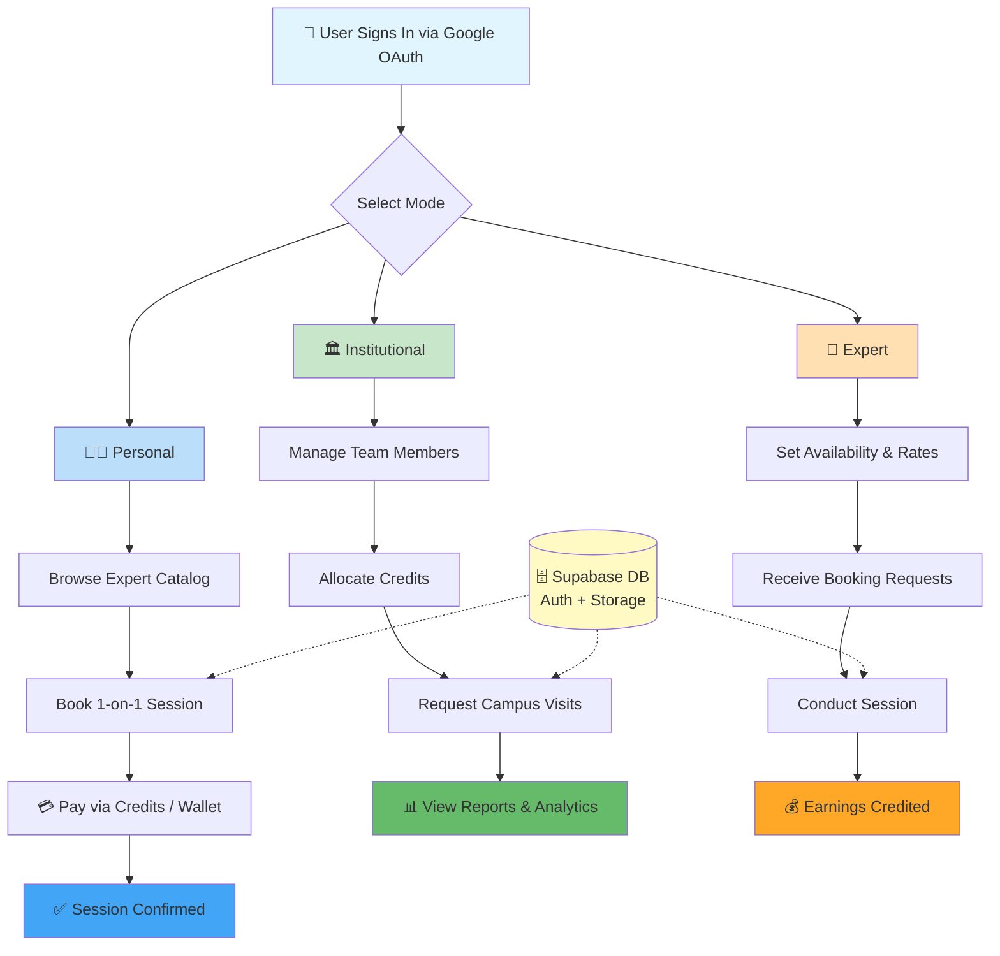

# 🌐 Wisora — India's Expert Guidance Platform

<div align="center">


*Talk to real experience. Not pre-recorded videos. Not generic advice.*

</div>

---

## 📖 Overview

**Wisora** is India's most intelligent expert guidance platform — where students, professionals, and institutions connect directly with verified domain experts for live, on-demand 1-on-1 sessions.

Most platforms sell you courses. **Wisora gives you people.**

Whether you're a student figuring out your career, a professional making a pivot, or an institution looking to upskill your team — Wisora connects you directly with verified experts for real, live conversations with people who've actually been there.

### 🎯 Who is it for?

- 🧑‍🎓 **Students** figuring out their career path
- 💼 **Professionals** making a pivot or seeking mentorship
- 🏛️ **Institutions** managing team-wide expert access at scale
- 🧠 **Experts** monetizing their knowledge and time

---

## 💡 The Problem We Solve

<div align="center">

```
┌──────────────────────────────────────────────────────────────────┐
│                                                                  │
│   ❌  Generic YouTube videos don't answer YOUR specific problem  │
│   ❌  Courses take months — you need answers NOW                 │
│   ❌  LinkedIn cold messages go unanswered                       │
│   ❌  Consultants are expensive and hard to find                 │
│                                                                  │
│   ✅  Wisora connects you to the RIGHT expert in minutes         │
│   ✅  Live 1-on-1 sessions — 30 or 60 minutes                   │
│   ✅  Verified professionals across every domain                 │
│   ✅  Affordable credits-based system                            │
│                                                                  │
└──────────────────────────────────────────────────────────────────┘
```

</div>

---

## 🎭 Three Worlds. One Platform.

<div align="center">

| 🧑‍🎓 **PERSONAL** | 🏛️ **INSTITUTIONAL** | 🧠 **EXPERT** |
|:---:|:---:|:---:|
| Students & individuals | Colleges & enterprises | Verified professionals |
| Book 1-on-1 sessions | Manage team-wide access | Offer your time & knowledge |
| AI-guided discovery | Campus visit coordination | Track earnings & bookings |
| Wallet & subscriptions | Credits & reporting | Build your expert profile |
| Course access | Institutional events | Manage booking requests |

> **One login. All three modes. Zero friction.**

</div>

---

## 📈 Platform Flowchart



---

## ⚡ Core Features

### 🎯 Feature Overview

<div align="center">

| Feature | Description | Status |
|---------|-------------|--------|
| 🎯 **Expert Discovery** | Browse verified experts by domain, rating & availability | ✅ Live |
| 📅 **Smart Booking** | Book 30 / 60 min live sessions with real-time slots | ✅ Live |
| 🤖 **AI Assistant** | Context-aware chatbot to guide users across the platform | ✅ Live |
| 🏛️ **Institutional Hub** | Events, campus visits & team management dashboard | ✅ Live |
| 💳 **Credits & Wallets** | Flexible credits-based plans for personal & institutional users | ✅ Live |
| 📊 **Expert Dashboard** | Earnings tracking, booking requests & analytics | ✅ Live |
| 🔐 **Google OAuth** | One-click secure sign-in via Firebase | ✅ Live |
| 🌐 **Bilingual** | Full Arabic + English support with RTL layout | ✅ Live |
| 📱 **Mobile Ready** | Capacitor-powered native iOS & Android app | 🔄 Beta |
| 💬 **Group Discussions** | Collaborative forums and shared resources | ✅ Live |

</div>

### 🔥 What Makes Wisora Different

- ✨ **Verified Experts Only** — Every expert is manually reviewed before going live
- 🖼️ **Three-Mode Architecture** — Personal, Institutional, Expert — all in one app
- 🎨 **AI-Powered Matching** — Smart chatbot helps users find the right expert fast
- 🚀 **Real-Time Booking** — No back-and-forth emails, instant slot confirmation
- 📊 **Institutional Analytics** — Full reporting suite for colleges and enterprises
- 🌐 **Built for India** — Designed ground-up for Indian students and institutions

---

## 🏗️ Architecture

<div align="center">

```
┌─────────────────────────────────────────────────────────────────┐
│                     ✦ WISORA ARCHITECTURE ✦                     │
└─────────────────────────────────────────────────────────────────┘

    📱 CLIENT (React + TypeScript + Vite)
              ↓
    ┌─────────────────────────────────────┐
    │   🔐 AUTH LAYER                     │
    │                                     │
    │  • Firebase Google OAuth            │
    │  • Session-based persistence        │
    │  • Protected route guards           │
    └─────────────────────────────────────┘
              ↓
    ┌─────────────────────────────────────┐
    │   🧠 APPLICATION LAYER              │
    │                                     │
    │  • Redux Toolkit (global state)     │
    │  • React Query (server state)       │
    │  • Context API (auth + language)    │
    └─────────────────────────────────────┘
              ↓
    ┌─────────────────────────────────────┐
    │   🗄️ DATA LAYER                     │
    │                                     │
    │  • Supabase PostgreSQL (database)   │
    │  • Supabase Storage (files/media)   │
    │  • Supabase Edge Functions (logic)  │
    └─────────────────────────────────────┘
              ↓
    ┌─────────────────────────────────────┐
    │   🤖 AI LAYER                       │
    │                                     │
    │  • OpenRouter API (chat AI)         │
    │  • Gemini API (content generation)  │
    │  • Vapi (voice AI sessions)         │
    └─────────────────────────────────────┘
```

</div>

---

## 🛠️ Tech Stack

<div align="center">

| Layer | Technology | Purpose |
|:------|:-----------|:--------|
|  | **React 18 + TypeScript** | Frontend framework |
|  | **Vite** | Build tool & dev server |
|  | **Tailwind CSS + shadcn/ui** | Styling & components |
|  | **Supabase** | Auth, DB, Storage, Edge Functions |
|  | **Firebase** | Google OAuth |
|  | **Redux Toolkit** | Global state management |
|  | **OpenRouter + Gemini** | AI assistant & content |
|  | **Capacitor** | iOS & Android native app |
|  | **Vercel** | Deployment & hosting |

</div>

---

## 🏗️ Project Structure

```
wisora/
├── src/
│   ├── components/
│   │   ├── auth/              # Auth screens & route guards
│   │   ├── courses/           # Course management UI
│   │   ├── chatbot/           # AI assistant sidebar
│   │   ├── experts/           # Expert booking modals
│   │   ├── groups/            # Group chat & sharing
│   │   ├── landing/           # Marketing & hero sections
│   │   └── layout/            # Navbar, sidebar, shell
│   ├── pages/
│   │   ├── personal/          # Student dashboard & flows
│   │   ├── institutional/     # Institution dashboard
│   │   ├── expert/            # Expert portal
│   │   └── admin/             # Admin panel
│   ├── contexts/              # Auth, Language, Tenant contexts
│   ├── hooks/                 # Custom React hooks
│   ├── integrations/          # Firebase + Supabase clients
│   ├── store/                 # Redux slices & store
│   └── i18n/                  # Arabic + English translations
├── public/
│   └── assests/               # Logos, avatars, 3D shapes
├── vercel.json                # SPA rewrite rules
└── capacitor.config.ts        # Mobile app config
```

---

## 📥 Installation & Usage

### 🔧 Prerequisites

- Node.js 18+
- npm or bun
- Supabase project (free tier works)
- Firebase project with Google OAuth enabled

### 📦 Clone & Install

```bash
# Clone the repository
git clone https://github.com/VighneshBhati/Wisora.git

# Navigate to project directory
cd Wisora

# Install dependencies
npm install
```

### ⚙️ Environment Setup

```bash
# Create your env file
cp .env.example .env
```

```env
# Supabase
VITE_SUPABASE_URL=your_supabase_project_url
VITE_SUPABASE_PUBLISHABLE_KEY=your_supabase_anon_key
VITE_SUPABASE_PROJECT_ID=your_project_id

# AI Services
VITE_OPENROUTER_API_KEY=your_openrouter_key
VITE_GEMINI_API_KEY=your_gemini_key
VITE_GEMINI_BASE_URL=https://generativelanguage.googleapis.com/v1beta/models/gemini-2.0-flash:generateContent?key=

# Voice AI
VITE_VAPI_ACCOUNT_PUBLIC_KEY=your_vapi_key
VITE_VAPI_TUTOR_AGENT_ID=your_tutor_agent_id
VITE_VAPI_QUESTIONS_AGENT_ID=your_questions_agent_id
```

### 🚀 Run Locally

```bash
npm run dev
# App runs at http://localhost:5173
```

---

## 🌍 Deployment on Vercel

```bash
# vercel.json is already configured with SPA rewrites
# Connect your GitHub repo on vercel.com and deploy
```

**Before going live, make sure to:**

- ✅ Add your Vercel domain to **Firebase Console → Authentication → Authorized Domains**
- ✅ Add your domain to **Google Cloud Console → OAuth 2.0 → Authorized Origins**
- ✅ Set all `VITE_*` environment variables in **Vercel Dashboard → Settings → Environment Variables**
- ✅ Never push your `.env` file — add secrets directly in Vercel

---

## 📊 Results & Metrics

<div align="center">

| Metric | Value | Status |
|--------|-------|--------|
| 🎯 **Modes Supported** | 3 (Personal, Institutional, Expert) | ✅ Complete |
| 🌐 **Languages** | 2 (English + Arabic RTL) | ✅ Complete |
| 📱 **Platforms** | Web + iOS + Android | ✅ Complete |
| 🔐 **Auth Methods** | Google OAuth via Firebase | ✅ Live |
| 🤖 **AI Integrations** | OpenRouter + Gemini + Vapi | ✅ Live |
| 📦 **Components** | 100+ reusable UI components | ✅ Built |

</div>

---

## 🤝 Contributing

We welcome contributions. Please open an issue first to discuss major changes.

1. Fork the repository
2. Create your feature branch (`git checkout -b feature/AmazingFeature`)
3. Commit your changes (`git commit -m 'Add AmazingFeature'`)
4. Push to the branch (`git push origin feature/AmazingFeature`)
5. Open a Pull Request

---

## 👥 The Team

<div align="center">

```
╔══════════════════════════════════════════════════════════════════╗
║                                                                  ║
║   ✦  Arsh Maheshwari        Founder & CEO                        ║
║                                                                  ║
║   ✦  Vighnesh Bhati         Co-Founder & Technology Partner      ║
║                                                                  ║
╚══════════════════════════════════════════════════════════════════╝
```

</div>

---

## 📄 License

```
Private & Proprietary

Copyright (c) 2025 Wisora

All rights reserved. Unauthorized use, reproduction, or distribution
of this software or any portion of it is strictly prohibited without
the express written permission of the copyright holders.
```

---

## 🙏 Acknowledgments

- **Supabase** for the incredible open-source backend platform
- **Firebase** for seamless Google OAuth integration
- **shadcn/ui** for the beautiful component library
- **Vercel** for zero-config deployment
- **OpenRouter & Google Gemini** for powering the AI layer

---

<div align="center">

### 🌟 Star this repository if you find it helpful! 🌟

**Made with ❤️ for India's next generation of learners and professionals**

[⬆ Back to Top](#-wisora--indias-expert-guidance-platform)

</div>
